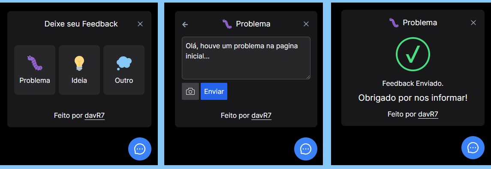

  

# FeedbackWidget

FeedbackWidget é um componente de feedback desenvolvido com NextJS e estilizado utilizando Tailwind CSS. Este widget permite aos usuários enviar feedback de forma rápida e eficiente, incluindo capturas de tela para torna o feedback mais detalhado.

### Stack Utilizada:

- nextjs v14.2.3
- react-icons v5.2.1
- Tailwind CSS v3.4.1
- typescript v5
- html2canvas v1.4.1

### Principais Scripts

- npm run dev: Inicia modo de desenvolvimento.
- npm run build: Cria um aplicativo para produção na pasta build.

---

  

